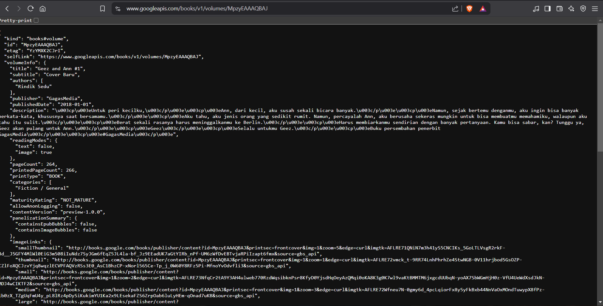

# Laporan Praktikum - W5: Soal 2

## Tujuan
Tugas ini bertujuan untuk mengakses data buku menggunakan API Google Books. Dengan mengganti ID buku di URL API yang ada, saya berhasil mengambil data JSON terkait buku yang dipilih.

## Langkah-langkah

1. **Mencari ID Buku**:
   - Buku yang saya pilih adalah buku dengan judul "Enjoy Flutter".
   - Saya mencari buku ini di **Google Books** dan mendapatkan URL berikut:
     ```
     https://books.google.co.id/books/edition/Enjoy_Flutter/MpzyEAAAQBAJ?hl=id&gbpv=1&dq=flutter&pg=PA86&printsec=frontcover
     ```

2. **Mengganti ID Buku di Kode**:
   - Di dalam kode yang telah saya buat, terdapat path yang digunakan untuk mengambil data buku dari Google Books API.
   - Saya mengganti ID buku di path tersebut dengan ID yang saya dapatkan dari URL di browser, yaitu `MpzyEAAAQBAJ`.

   Berikut adalah perubahan yang saya lakukan pada kode:
   ```dart
   const path = '/books/v1/volumes/MpzyEAAAQBAJ';  // Ganti ID buku dengan MpzyEAAAQBAJ

Berikut adalah hasil screenshot :

