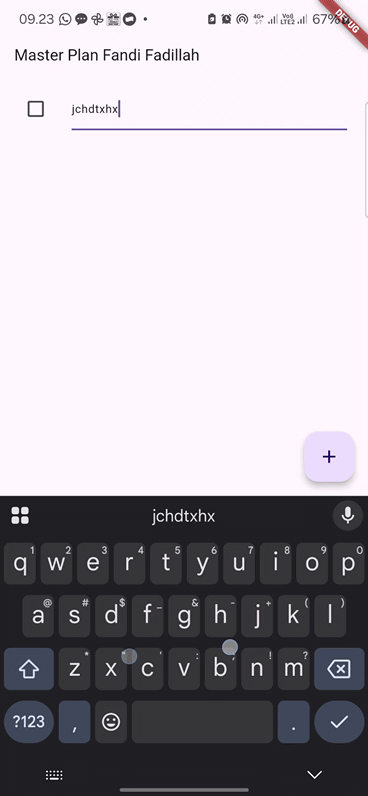
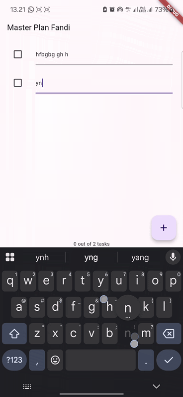
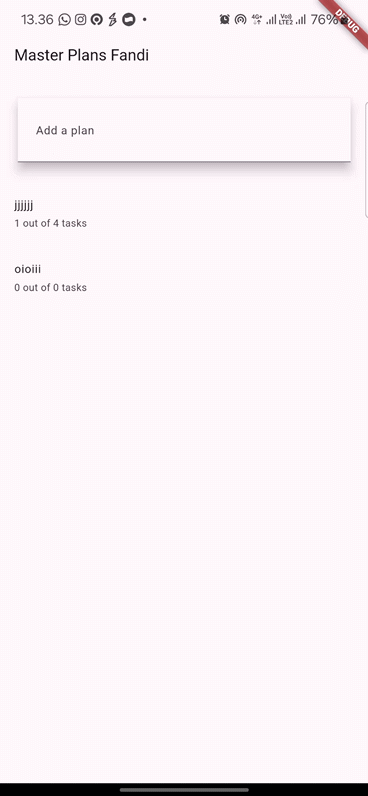

# Dokumentasi Praktikum Master Plan

## Hasil Akhir Praktikum

Berikut adalah hasil akhir dari praktikum dalam bentuk GIF:

## Penjelasan Praktikum

Praktikum ini bertujuan untuk membuat aplikasi perencanaan tugas menggunakan Flutter.
Aplikasi ini memungkinkan pengguna untuk menambahkan tugas, menandai tugas sebagai selesai, dan menggulir daftar tugas.

### **Langkah 4: Penjelasan**

Langkah 4 bertujuan untuk membuat struktur proyek agar lebih terorganisir dengan memisahkan tampilan (UI) dari logika data. Dengan menggunakan folder **models**, kita dapat mengelola struktur data secara terpisah dari tampilan UI.

### **Langkah 6: Mengapa Perlu Variabel `plan`?**

Variabel `plan` digunakan untuk menyimpan data perencanaan yang mencakup daftar tugas. Dibuat sebagai konstanta (`const Plan()`) untuk memastikan bahwa nilai awalnya tetap dan tidak dapat diubah langsung, sehingga setiap perubahan harus dilakukan dengan membuat objek baru.

### **Langkah 9: Hasil dan Penjelasan**

Langkah ini menambahkan tampilan **ListTile** untuk setiap tugas dalam daftar perencanaan. Berikut adalah GIF hasil implementasi:

Pada langkah ini, setiap tugas ditampilkan dalam bentuk **TextFormField** dan dapat ditandai dengan checkbox.

### **Kegunaan Method pada Langkah 11 dan 13 dalam Lifecycle State**

- **Langkah 11 (`initState`)**
  - Method ini digunakan untuk menginisialisasi `ScrollController`.
  - Menambahkan listener untuk menghapus fokus dari semua input teks ketika pengguna menggulir daftar.
- **Langkah 13 (`dispose`)**

  - Method ini digunakan untuk membersihkan `ScrollController` saat widget dihapus dari tree.
  - Mencegah kebocoran memori dengan memastikan controller tidak terus berjalan setelah widget tidak lagi digunakan.

---

## Penjelasan Praktikum 2

### 1. **Penjelasan tentang `InheritedWidget` dan Penggunaan `InheritedNotifier` pada Langkah 1**

Pada Langkah 1, kita diminta untuk membuat file `plan_provider.dart` yang berisi class `PlanProvider`. Dalam class ini, kita menggunakan konsep **InheritedWidget**.

- **`InheritedWidget`** adalah widget di Flutter yang memungkinkan data untuk diteruskan ke subtree widget yang lebih dalam dalam widget tree. Widget ini digunakan agar child widgets dapat mengakses data yang ada di widget yang lebih atas dalam tree tanpa perlu meneruskan data tersebut secara eksplisit melalui constructor. Biasanya digunakan untuk keadaan global yang perlu dibagikan di banyak tempat dalam aplikasi (seperti tema, pengaturan, dll).

Namun, pada contoh ini, kita menggunakan **`InheritedNotifier<ValueNotifier<T>>`** sebagai pengganti **`InheritedWidget`**.

- **`InheritedNotifier`** adalah subclass dari `InheritedWidget`, tetapi dengan tambahan kemampuan untuk bekerja dengan objek `ValueNotifier`. **`ValueNotifier`** adalah objek yang dapat memberikan pemberitahuan (notify) kepada listener-nya jika nilainya berubah. Oleh karena itu, dengan menggunakan **`InheritedNotifier<ValueNotifier<Plan>>`**, kita bisa memberikan pemberitahuan perubahan pada data `Plan` dan memastikan bahwa widget-widget yang bergantung pada data ini dapat merespons perubahan tersebut secara otomatis.

**Mengapa menggunakan `InheritedNotifier`?**  
Karena **`InheritedNotifier`** memungkinkan kita untuk menghubungkan data yang bersifat mutable (dalam hal ini adalah data `Plan` yang dapat berubah) dengan widget yang ingin mendengarkan perubahan data tersebut. Jadi, menggunakan `InheritedNotifier<ValueNotifier<Plan>>` memungkinkan kita untuk memanfaatkan fungsi `ValueNotifier` dalam pengelolaan status aplikasi yang dinamis.

---

### 2. **Penjelasan tentang Method pada Langkah 3 (Metode `completedCount` dan `completenessMessage`)**

Pada Langkah 3, kita diminta untuk menambahkan dua method dalam class `Plan` di file `plan.dart`.

**Penjelasan**:

- **`completedCount`** adalah method yang menghitung jumlah task yang telah selesai.

  - **`tasks`** adalah daftar task yang ada dalam `Plan`.
  - **`where((task) => task.complete)`** adalah fungsi filter yang mencari task-task yang memiliki properti `complete` bernilai `true`, yang menandakan bahwa task tersebut telah selesai.
  - **`length`** kemudian mengembalikan jumlah task yang telah selesai.

- **`completenessMessage`** adalah method yang menghasilkan pesan yang menunjukkan seberapa banyak task yang telah diselesaikan dari total task yang ada.
  - Method ini memanggil `completedCount` untuk mendapatkan jumlah task yang selesai dan kemudian menghasilkan string seperti: `"3 out of 5 tasks"`, yang memberikan gambaran tentang progres penyelesaian task.

**Mengapa dilakukan demikian?**
Penting untuk memberikan informasi visual yang menggambarkan seberapa banyak progress yang telah tercapai, terutama dalam aplikasi pengelolaan tugas seperti ini. Dengan menambahkan `completedCount` dan `completenessMessage`, kita dapat memberikan feedback langsung kepada pengguna tentang status tugas yang telah mereka kerjakan.

---

### 3. **Capture GIF Hasil dari Langkah 9 dan Penjelasan**

**Capture GIF**:

Penjelasan mengenai hasil dari Langkah 9:

- Pada Langkah 9, kita melakukan wrapping pada widget `_buildList` dengan widget **`Expanded`** dan menambahkan widget **`SafeArea`** di bagian bawah untuk menampilkan **`completenessMessage`**. Hal ini bertujuan agar tampilan progres tugas tetap terlihat dengan jelas di bagian bawah layar tanpa terganggu oleh elemen UI lainnya.
- **`Expanded`**: Widget ini memastikan bahwa daftar tugas akan memanfaatkan ruang yang tersedia di layar sesuai dengan ukuran yang ada, dan memastikan bahwa footer yang berisi pesan progres tetap berada di bagian bawah layar.
- **`SafeArea`**: Widget ini digunakan untuk memastikan bahwa widget yang berada di dalamnya tidak tertutup oleh area layar yang tidak dapat digunakan seperti status bar atau navigasi sistem. Jadi, teks yang menampilkan progres (`completenessMessage`) akan selalu terlihat dengan baik meskipun pada perangkat dengan notch atau area lain yang terhalang.

**Apa yang telah dibuat?**

- Kami telah membuat sebuah aplikasi pengelolaan tugas dengan state management menggunakan `InheritedNotifier` untuk menyediakan data `Plan` kepada widget-widget turunannya.
- Dengan menggunakan `ValueListenableBuilder`, aplikasi akan merespons perubahan pada data dan memperbarui tampilan secara otomatis.
- Kami juga telah menambahkan fitur untuk menghitung progress dari task yang diselesaikan dan menampilkannya di bagian bawah layar.

---

### Praktikum 3

### Penjelasan Diagram Aplikasi berdasarkan Praktikum 3

#### **Bagian 1: `MaterialApp`, `PlanProvider`, `PlanCreatorScreen`, dan Struktur UI**

1. **MaterialApp**:

   - `MaterialApp` adalah widget root dari aplikasi Flutter yang menyediakan berbagai konfigurasi untuk aplikasi Anda, seperti tema dan rute navigasi. Dalam konteks diagram ini, `MaterialApp` membungkus seluruh aplikasi dan menyediakan kerangka dasar yang digunakan oleh widget lain di aplikasi.

2. **PlanProvider**:

   - `PlanProvider` adalah widget yang menggunakan `InheritedNotifier` untuk menyediakan data berbentuk `ValueNotifier<List<Plan>>` ke seluruh bagian aplikasi. Ini memungkinkan widget anak (seperti `PlanScreen` dan `PlanCreatorScreen`) untuk mengakses dan memperbarui data rencana yang ada di dalam aplikasi tanpa harus menurunkan data secara manual ke setiap widget.

3. **PlanCreatorScreen**:

   - `PlanCreatorScreen` adalah layar tempat pengguna dapat menambah rencana baru. Pada layar ini terdapat elemen UI seperti `TextField` untuk memasukkan nama rencana baru dan tombol untuk menyimpan data tersebut ke dalam daftar rencana.

4. **Column**:

   - `Column` adalah widget layout yang memungkinkan Anda menyusun widget secara vertikal. Dalam diagram ini, `Column` digunakan untuk menampilkan beberapa widget secara vertikal seperti `TextField` (untuk memasukkan nama rencana) dan daftar rencana yang telah ada.

5. **TextField**:

   - `TextField` adalah widget input untuk menerima teks dari pengguna. Dalam `PlanCreatorScreen`, pengguna akan memasukkan nama rencana baru menggunakan `TextField`, dan setelah input selesai, aplikasi akan memperbarui daftar rencana dengan menambahkannya.

6. **Expanded**:

   - `Expanded` digunakan untuk memberi ruang secara proporsional pada widget di dalamnya. Dalam diagram ini, `Expanded` digunakan untuk membuat elemen-elemen dalam aplikasi (misalnya daftar rencana) menempati ruang yang tersisa di layar setelah widget lain (seperti `TextField` atau header) diposisikan.

7. **ListView**:
   - `ListView` digunakan untuk menampilkan daftar item yang dapat digulir. Dalam diagram ini, `ListView` digunakan untuk menampilkan daftar rencana yang ada. Pengguna dapat menggulir daftar ini jika ada banyak rencana yang ditambahkan.

---

#### **Bagian 2: `Navigator.push`, `PlanScreen`, `Scaffold`, `Column`, `SafeArea`, `ListView`, dan `Text`**

1. **Navigator.push**:

   - `Navigator.push` digunakan untuk menavigasi pengguna ke layar baru. Dalam hal ini, ketika pengguna menekan salah satu rencana di `PlanCreatorScreen`, aplikasi menggunakan `Navigator.push` untuk membuka `PlanScreen` dengan detail dari rencana tersebut.

2. **MaterialApp**:

   - `MaterialApp` juga digunakan pada `PlanScreen`, yang memberikan struktur dan tema material design untuk aplikasi.

3. **PlanScreen**:

   - `PlanScreen` adalah layar detail yang menampilkan informasi lebih lanjut mengenai rencana yang dipilih. Di sini, pengguna dapat melihat tugas-tugas terkait dengan rencana tersebut. `PlanScreen` menerima `Plan` yang dipilih melalui konstruktor dan menampilkan tugas yang ada.

4. **Scaffold**:

   - `Scaffold` adalah widget yang memberikan struktur dasar untuk layout aplikasi, seperti app bar, body, dan floating action button. Pada `PlanScreen`, `Scaffold` digunakan untuk membangun layout dasar layar detail.

5. **Column**:

   - `Column` digunakan untuk menyusun widget-widget lainnya secara vertikal dalam tampilan layar detail. Di dalamnya terdapat `Expanded`, `SafeArea`, dan `ListView` untuk menampilkan tugas-tugas rencana yang ada.

6. **Expanded**:

   - Sama seperti di `PlanCreatorScreen`, `Expanded` digunakan di `PlanScreen` untuk memberikan ruang bagi `ListView` untuk menampilkan tugas-tugas yang ada dalam rencana.

7. **SafeArea**:

   - `SafeArea` digunakan untuk memastikan bahwa konten tidak berada di area yang tertutup oleh elemen-elemen UI seperti status bar atau navbar pada perangkat. Di sini, `SafeArea` digunakan untuk menampilkan informasi yang terkait dengan progres rencana seperti pesan kelengkapan tugas (completeness message).

8. **ListView**:

   - `ListView` digunakan untuk menampilkan daftar tugas dalam sebuah rencana. Setiap tugas ditampilkan dengan checkbox dan deskripsi. Pengguna dapat menggulir daftar tugas ini jika ada banyak tugas.

9. **Text**:
   - `Text` digunakan untuk menampilkan informasi mengenai rencana atau tugas, seperti nama rencana atau pesan kelengkapan tugas.

---

### **Capture GIF Hasil dari Langkah 14**

Berikut adalah penjelasan dari hasil capture GIF yang diambil pada Langkah 14.

#### **Proses yang Tampil dalam GIF:**

- **Menambah Rencana Baru**:
  - Pengguna membuka `PlanCreatorScreen`, mengetikkan nama rencana baru di `TextField`, dan menekan tombol untuk menambahkan rencana baru ke dalam daftar.
  - Rencana baru tersebut langsung ditambahkan ke dalam `ValueNotifier<List<Plan>>`, yang akan memicu pembaruan tampilan untuk menampilkan rencana yang baru saja ditambahkan.
- **Melihat Daftar Rencana**:
  - Setelah menambah rencana, daftar rencana yang ada di aplikasi akan diperbarui secara dinamis dan ditampilkan di bawah `TextField` menggunakan `ListView`.
- **Navigasi ke `PlanScreen`**:
  - Ketika pengguna memilih salah satu rencana dari daftar, aplikasi akan menavigasi pengguna ke `PlanScreen` untuk melihat detail dari rencana yang dipilih.
